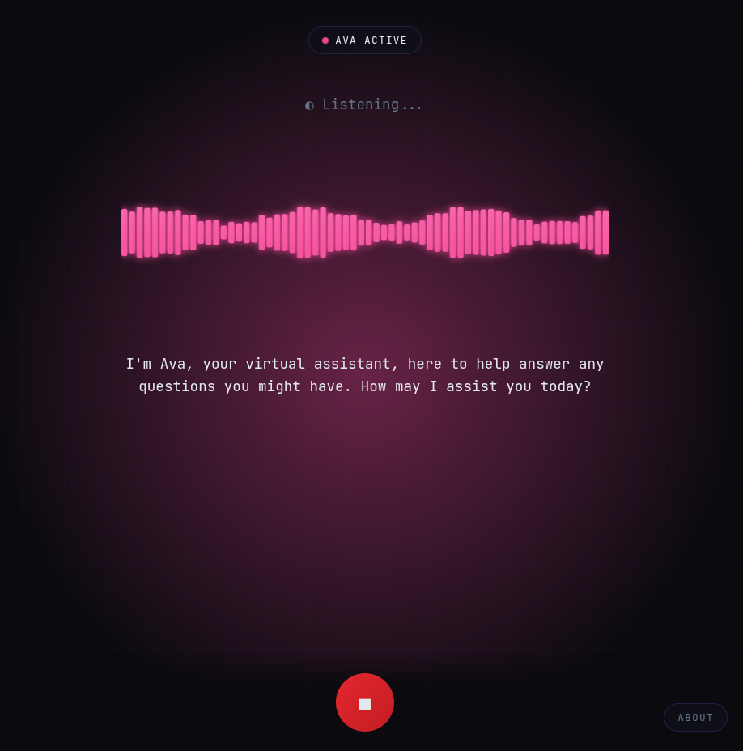

# Ava

A privacy-first AI voice assistant that runs entirely in the browser using WebAssembly. Zero server dependencies—all speech recognition, language model inference, and text-to-speech happen locally on-device.

**[Try the demo → https://ava.muthu.co](https://ava.muthu.co)**

See [CHANGELOG.md](CHANGELOG.md) for version history.



## Architecture

Ava uses a pipeline architecture with three WebAssembly-powered stages:

1. **Speech Recognition** — Audio from the microphone is captured and processed through Voice Activity Detection (Silero VAD) which detects when you stop speaking. The captured speech segment is then transcribed by Whisper (tiny-en model) via Transformers.js. This approach is more natural than fixed-interval processing.

2. **Language Model** — Transcribed text is passed to Gemma 3 270M via Wllama (llama.cpp WASM port). The `useConversation` composable orchestrates the flow, triggering inference when speech ends and streaming tokens back as they're generated.

3. **Speech Synthesis** — Generated text is split at sentence boundaries (`. ! ? ,`) and queued to the browser's native SpeechSynthesis API. This enables low-latency voice output that starts speaking before the full response is complete.

All processing happens client-side with zero network requests after initial model download.


## Technical Stack

| Component | Technology | Size |
|-----------|------------|------|
| Voice Activity Detection | Silero VAD v5 (@ricky0123/vad-web) | ~2MB |
| Speech-to-Text | Whisper tiny-en (@huggingface/transformers) | ~40MB |
| LLM | Gemma 3 270M Instruct (Wllama) | ~180MB |
| Text-to-Speech | Web Speech Synthesis API | Native |
| Audio Visualization | Web Audio API | Native |
| Frontend | Vue 3 + TypeScript | — |
| Build | Vite | — |

## Project Structure

```
src/
├── App.vue                      # Main application shell
├── components/
│   ├── AboutPopup.vue           # Info modal
│   └── WaveformVisualizer.vue   # Real-time audio visualization
├── composables/
│   ├── useConversation.ts       # Orchestrates conversation flow
│   ├── useWhisper.ts            # VAD + Whisper speech recognition
│   ├── useWllama.ts             # Gemma LLM inference
│   ├── useSpeechSynthesis.ts    # Browser TTS wrapper
│   └── useAudioVisualizer.ts    # Web Audio frequency analysis
├── styles/
│   └── main.css                 # Global styles
└── types/
    └── index.ts                 # TypeScript definitions
```

## Configuration

### LLM Settings (`useWllama.ts`)

```typescript
nPredict: 64,              // Max tokens (lower = faster response)
temp: 0.7,                 // Sampling temperature
top_k: 40,                 // Top-k sampling
top_p: 0.9,                // Nucleus sampling
```

### VAD Settings (`useWhisper.ts`)

```typescript
positiveSpeechThreshold: 0.5,  // Confidence threshold for speech detection
negativeSpeechThreshold: 0.35, // Threshold for non-speech
redemptionMs: 800,             // Wait time after speech ends before triggering
minSpeechMs: 200,              // Minimum speech duration to consider
preSpeechPadMs: 300,           // Audio to include before speech detected
```

### Sentence Boundary (`useWllama.ts`)

```typescript
const SENTENCE_BOUNDARY = /[.!?,](?:\s|$)/  // TTS triggers on punctuation
```

## Requirements

- **Browser**: Chrome 90+ or Edge 90+ (requires SharedArrayBuffer)
- **Headers**: Cross-Origin Isolation enabled
  ```
  Cross-Origin-Opener-Policy: same-origin
  Cross-Origin-Embedder-Policy: require-corp
  ```

## Permissions

Ava requires the following browser/system permissions:

| Permission | Purpose | Required |
|------------|---------|----------|
| Microphone | Voice input via Whisper | Yes |
| Audio Playback | Text-to-speech output | Yes |

### macOS

1. **System Preferences** → **Security & Privacy** → **Privacy** → **Microphone** → Enable your browser
2. When prompted by the browser, click **Allow** for microphone access
3. If audio doesn't play, check **System Preferences** → **Sound** → **Output**

### Windows

1. **Settings** → **Privacy** → **Microphone** → Allow apps to access microphone
2. Ensure your browser is listed and enabled

### Linux

1. Ensure PulseAudio/PipeWire is running
2. Grant microphone permission when prompted by the browser

## Development

```bash
npm install
npm run dev      # Start dev server with COOP/COEP headers
npm run build    # Production build
npm run preview  # Preview production build
```

## Performance Notes

- **First load**: Downloads ~220MB of models (cached by browser)
- **Inference**: VAD runs in real-time, Whisper ~0.3-0.5s, LLM ~1-2s
- **Memory**: ~500MB-1GB RAM usage during operation
- **WebGPU**: Not yet supported; runs on CPU via WASM SIMD

## License

MIT
