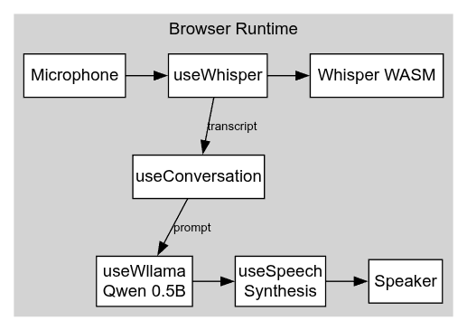
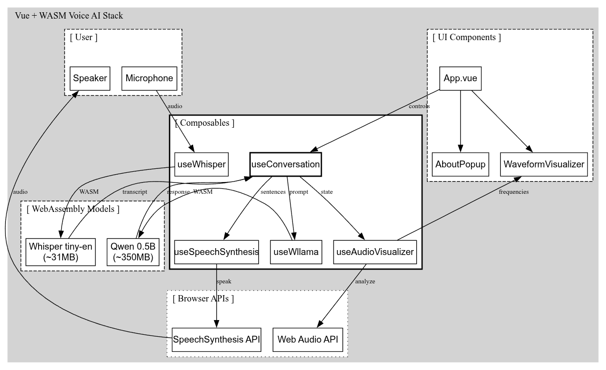

# Ava

A privacy-first AI voice assistant that runs entirely in the browser using WebAssembly. Zero server dependencies—all speech recognition, language model inference, and text-to-speech happen locally on-device.

**[Try the demo → https://ava.muthu.co](https://ava.muthu.co)**

## Architecture

Ava uses a pipeline architecture with three WebAssembly-powered stages:

1. **Speech Recognition** — Audio from the microphone is captured and processed by Whisper (tiny-en model) running in WASM. The `useWhisper` composable handles audio chunking and streams transcriptions every 2 seconds.

2. **Language Model** — Transcribed text is passed to Qwen 0.5B via Wllama (llama.cpp WASM port). The `useConversation` composable orchestrates the flow, triggering inference when speech ends and streaming tokens back as they're generated.

3. **Speech Synthesis** — Generated text is split at sentence boundaries (`. ! ? ,`) and queued to the browser's native SpeechSynthesis API. This enables low-latency voice output that starts speaking before the full response is complete.

All processing happens client-side with zero network requests after initial model download.





## Technical Stack

| Component | Technology | Size |
|-----------|------------|------|
| Speech-to-Text | Whisper (whisper-web-transcriber) | ~31MB |
| LLM | Qwen 2.5 0.5B Instruct (Wllama) | ~350MB |
| Text-to-Speech | Web Speech Synthesis API | Native |
| Audio Visualization | Web Audio API | Native |
| Frontend | Vue 3 + TypeScript | — |
| Build | Vite | — |

## Project Structure

```
src/
├── App.vue                      # Main application shell
├── components/
│   ├── AboutPopup.vue           # Info modal
│   └── WaveformVisualizer.vue   # Real-time audio visualization
├── composables/
│   ├── useConversation.ts       # Orchestrates conversation flow
│   ├── useWhisper.ts            # Whisper WASM speech recognition
│   ├── useWllama.ts             # Qwen LLM inference
│   ├── useSpeechSynthesis.ts    # Browser TTS wrapper
│   └── useAudioVisualizer.ts    # Web Audio frequency analysis
├── styles/
│   └── main.css                 # Global styles
└── types/
    └── index.ts                 # TypeScript definitions
```

## Configuration

### LLM Settings (`useWllama.ts`)

```typescript
nPredict: 64,              // Max tokens (lower = faster response)
temp: 0.7,                 // Sampling temperature
top_k: 40,                 // Top-k sampling
top_p: 0.9,                // Nucleus sampling
```

### Whisper Settings (`useWhisper.ts`)

```typescript
modelSize: 'tiny-en-q5_1', // Model variant (tiny/base, quantized)
audioIntervalMs: 2000,     // Processing interval
```

### Sentence Boundary (`useWllama.ts`)

```typescript
const SENTENCE_BOUNDARY = /[.!?,](?:\s|$)/  // TTS triggers on punctuation
```

## Requirements

- **Browser**: Chrome 90+ or Edge 90+ (requires SharedArrayBuffer)
- **Headers**: Cross-Origin Isolation enabled
  ```
  Cross-Origin-Opener-Policy: same-origin
  Cross-Origin-Embedder-Policy: require-corp
  ```

## Development

```bash
npm install
npm run dev      # Start dev server with COOP/COEP headers
npm run build    # Production build
npm run preview  # Preview production build
```

## Performance Notes

- **First load**: Downloads ~380MB of models (cached by browser)
- **Inference**: ~0.3-0.5s for Whisper, ~1-2s for LLM response
- **Memory**: ~500MB-1GB RAM usage during operation
- **WebGPU**: Not yet supported; runs on CPU via WASM SIMD

## License

MIT